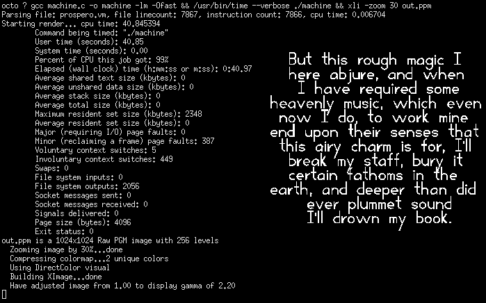
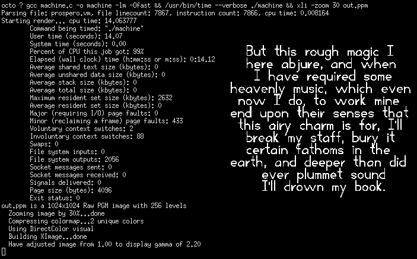
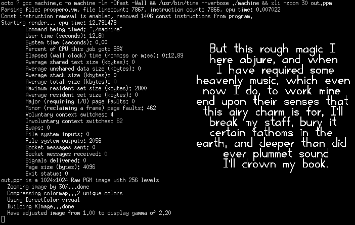

# The Prospero Challenge
### Simeon Veldstra, March 2025

Matt Keeter posted the [Prospero Challenge](https://www.mattkeeter.com/projects/prospero/)
earlier this month. 

The challenge is to build a renderer for an image created from a signed
distance function, as quickly as possible. Matt provided a simple 28 line
renderer in Python that uses numpy. 

The explanation was a bit terse, but between the numpy docs, and some HN
[comments](https://news.ycombinator.com/item?id=43465490), I got the picture.

Within two hours of the post hitting hacker news, someone had compiled it for a
RTX4090 and got 2000fps out of it. Well, there is no way I can touch that, but I
still couldn't stop thinking about it.

Matt's Python code takes about 16 seconds to run on my machine. 

I wrote some Python back in the day, and I recall the philosophy was to write
everything you could in Python, dropping into C for the bits that had to be
fast. I wondered how a simple interpreter written in C would do.

Well, I got it working in about 20x the Python line count. 

That's embarassing, my simple C implementation takes 5x longer to render the
image than a casual little Python script. 

Wait, this is C, if you want your program to run fast, you have to ask for that.

Okay, that's a bit better. With optimizations enabled, it's twice as fast, but
still 2.5x slower than the Python implementation. 

I suppose that numpy is actually an example of writing the bits that need to be
fast in C, just generalized to matrix math. There is no chance I'm a better
programmer than the numpy maintainers, but at the end of the day, it's the same
amount of math that needs to get done. I feel like the numbers should be
closer. 

What could cause numpy to be 2.5x faster than C on the same math? Well, my
machine has AVX2 instructions that allow the CPU to process 4 doubles at a time.
Just the thing for a matrix math package. Chances are the numpy folks are all
over that. 

I wrote a version of the interpreter that processes four pixels at once, and
interleaved the scratch memory so the four values are sequential in memory for
each instruction. It sure made the code ugly. C itself has no concept of SIMD,
but there are compiler intrinsics you can sprinkle around to invoke them. Then
you need a bunch of feature test macros, and a block of code for each different
type of scheme, SSE, AVX, etc. It gets real ugly, fast. And you've got to find
different machines to test on, and keep it all up to date with the latest CPUs. 

Or you can use a tactic that works well on many arrogant people, set the memory
up correctly, perform the float ops four at a time and say nothing at all to the
compiler about it, just give it -O3 or -Ofast and let it think that it thought
of this great optimization opportunity all on its own. Worked like a charm:

It's close to the numpy result, 15% faster. 

So there you have it, you can replace the important bits with C and still
realize a speedup over Python. Is all that code (and a buffer overflow
vulnerability or two, surely) really worth it for a mere 15% speedup? 

On the other hand, observant readers may have noticed another difference in
performance. The Python solution uses fifty-and-a-half gigabytes of RAM to
calculate the result. The SIMD enabled C program uses just 2.5 megabytes. That's
20,000x less memory. One of those megabytes is the output buffer. 

There is no huge trick here. The language describing the SDF has no control
flow, and is in Single Static Assignment form. Essentially, every instruction
is an assigment. Just naively storing all the intermediates needs only 4 bytes
per each instruction in the function. So that's what I did. I allocate a block that
size and just keep passing it into the function that calculates the pixel.
Actually, I had to quadruple the scratch memory for the SIMD interpreter, and I
kept the single instruction wide function for images that are not multiples of
four in size, so memory use is 5x instruction count x4 bytes. 

The problem looks embarassingly parallel, and fits into the numpy solution
neatly. Unfortunately, to calculate the pixels in parallel, you need to keep
track of intermediate values of all the pixels at once. That gets expensive.
Worst of all, the Python program only runs in one thread, so there is no actual
speed gain from organizing the problem that way. 

One consequence of using a block of scratch memory like this is after the first
run through the interpreter, each subsequent run writes all the same constant values
into the block, overwriting identical bits. That's a waste of time. I modified
the parser to emit two instruction lists, one with all const instructions
removed. The interpreter switches to the const-free function after using a
memory block once with the full function to populate the values.. 

This saves ~1.4 billion redundant memory stores for a 1024
sized image, and runs about 8% faster, around 13 seconds here. 

I have enough cores I should be able to split the work and get it done in under
a second, but I want to experiment with some optimizations first, starting with
const-folding.

I'm up past my bedtime again, so that's enough for now.
